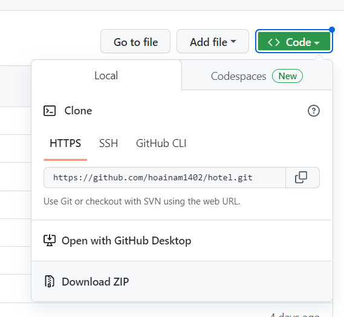
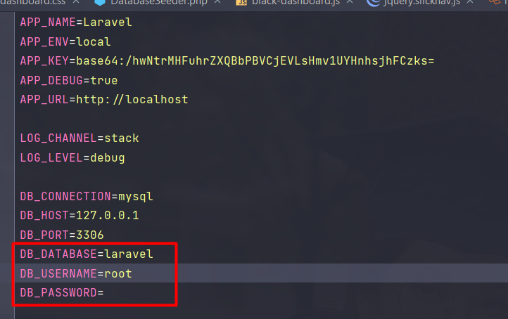

## How to run project

- **[Clone project in github]()**
  https://github.com/hoainam1402/hotel.git or download zip

- **[Run terminal]()**
- cp .env.example .env
- composer install
- php artisan key:generate
- open file .env  edit info database
- php artisan composer dump-autoload
- php artisan storage:link
- php artisan migrate
- php artisan db:seed
- php artisan jwt:secret
